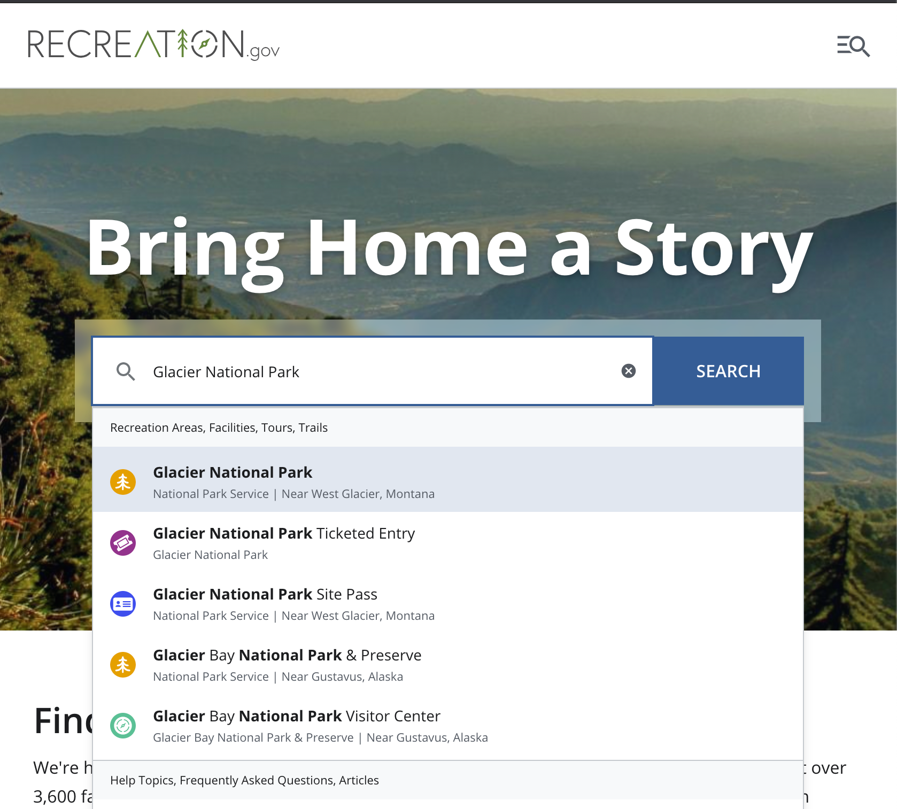

<p align="center">
  
</p>

`camply`, the campsite finder, is a tool to help you book an online campground. Finding reservations
at sold out campgrounds can be tough. That's where `camply` comes in. It scrapes the APIs of Booking
Services like https://recreation.gov (which works on thousands of campgrounds across the USA) to
continuously check for cancellations and availabilities to pop up. Once a campsite becomes
available, `camply` sends you a notification to book your spot!

[](https://github.com/juftin/camply)
[](https://github.com/juftin/camply/actions/workflows/pytest.yaml)
[](https://pypi.python.org/pypi/camply/)

## Important Notice

`camply` is still under active development and is not fully ready. Once this project is fully ready
code will be released to a `main` branch. If you'd like to contribute to the project please reach
out.

## Table of Contents

- [Important Notice](#important-notice)
- [Usage](#usage)
    * [Command Line Usage](#command-line-usage)
    * [Examples](#examples)
        + [Searching for a Campsite](#searching-for-a-campsite)
        + [Generating the config file for notifications](#generating-the-config-file-for-notifications)
        + [Continuously Searching For A Campsite](#continuously-searching-for-a-campsite)
        + [Look for weekend campsite availabilities](#look-for-weekend-campsite-availabilities)
        + [Look for a campsite inside of Yellowstone](#look-for-a-campsite-inside-of-yellowstone)
        + [Look for Recreation Areas to Search](#look-for-recreation-areas-to-search)
        + [Look for specific campgrounds within a recreation area](#look-for-specific-campgrounds-within-a-recreation-area)
        + [Look for specific campgrounds that match a query string](#look-for-specific-campgrounds-that-match-a-query-string)
        + [YAML Config Campsite Search](#yaml-config-campsite-search)
    * [Finding Recreation Areas and Campgrounds without Using the Command Line](#finding-recreation-areas-and-campgrounds-without-using-the-command-line)
    * [Object Oriented Usage](#object-oriented-usage)
        + [Object-Oriented Campsite Search:](#object-oriented-campsite-search-)
- [Dependencies](#dependencies)

## Usage

### Command Line Usage

When installed, `camply`'s command line utility can be invoked with the command, `camply`. The CLI
tool accepts four sub-arguments:

1) `campsites`
   Find Available Campsites using Search Criteria
2) `recreation-areas`
3) `campgrounds`
4) `configure`

```text
❯ camply
2021-05-11 20:39:01,327 [  CAMPLY]: camply, the campsite finder ⛺️
usage: camply [-h] [--version] {campsites,recreation-areas,campgrounds,configure} ...

Welcome to camply, the campsite finder. Finding reservations at these sold out campgrounds can be
tough. That's where camply comes in. It scrapes the APIs of Booking Services like
https://recreation.gov (which works on thousands of campgrounds across the USA) to continuously check
for cancellations and availabilities to pop up. Once a campsite becomes available, camply sends you a
notification to book your spot!

positional arguments:
  {campsites,recreation-areas,campgrounds,configure}
    campsites           Find Available Campsites using Search Criteria
    recreation-areas    Search for Recreation Areas and list them.
    campgrounds         Search for Campgrounds (inside of Recreation Areas) and list them
    configure           Set up camply configuration file with an interactive console

optional arguments:
  -h, --help            show this help message and exit
  --version             show program's version number and exit
```

### Examples

#### Searching for a Campsite

```shell
camply campsites \
    --rec-area-id 2725 \
    --start-date 2021-06-10 \
    --end-date 2021-06-17
```

```text 
2021-05-09 23:54:37,666 [  CAMPLY]: camply, the campsite finder ⛺️
2021-05-09 23:54:37,670 [    INFO]: 8 dates selected for search, ranging from 2021-06-10 to 2021-06-17
2021-05-09 23:54:37,670 [    INFO]: Retrieving Facility Information for Recreation Area ID: `2725`.
2021-05-09 23:54:38,119 [    INFO]: 4 camping facilities found
2021-05-09 23:54:38,120 [    INFO]: ⛰  Glacier National Park, MT (#2725) - 🏕  Apgar Group Sites (#234669)
2021-05-09 23:54:38,120 [    INFO]: ⛰  Glacier National Park, MT (#2725) - 🏕  Fish Creek Campground (#232493)
2021-05-09 23:54:38,120 [    INFO]: ⛰  Glacier National Park, MT (#2725) - 🏕  Many Glacier Campground (#251869)
2021-05-09 23:54:38,120 [    INFO]: ⛰  Glacier National Park, MT (#2725) - 🏕  St. Mary Campground (#232492)
2021-05-09 23:54:38,120 [    INFO]: Searching across 4 campgrounds
2021-05-09 23:54:38,120 [    INFO]: Searching Many Glacier Campground, Glacier National Park, MT (251869) for availability: June, 2021
2021-05-09 23:54:38,296 [    INFO]: 	⛺️	1 total sites found in month of June
2021-05-09 23:54:39,698 [    INFO]: Searching Apgar Group Sites, Glacier National Park, MT (234669) for availability: June, 2021
2021-05-09 23:54:40,059 [    INFO]: 	❌	0 total sites found in month of June
2021-05-09 23:54:41,461 [    INFO]: Searching Fish Creek Campground, Glacier National Park, MT (232493) for availability: June, 2021
2021-05-09 23:54:42,744 [    INFO]: 	❌	0 total sites found in month of June
2021-05-09 23:54:44,149 [    INFO]: Searching St. Mary Campground, Glacier National Park, MT (232492) for availability: June, 2021
2021-05-09 23:54:44,863 [    INFO]: 	❌	0 total sites found in month of June
2021-05-09 23:54:44,863 [    INFO]: ⛺️ ⛺️ ⛺️ ⛺️ 1 Reservable Campsites Matching Search Preferences
2021-05-09 23:54:44,866 [    INFO]: 📅 Mon, June 14 🏕  1 sites
2021-05-09 23:54:44,868 [    INFO]: 	⛰️  Glacier National Park, MT  🏕  Many Glacier Campground: ⛺ 1 sites
2021-05-09 23:54:44,868 [    INFO]: 		🔗 https://www.recreation.gov/camping/campsites/10045292
2021-05-09 23:54:44,868 [  CAMPLY]: Exiting camply 👋
```

#### Generating the config file for notifications

```shell
camply configure
```

```text
2021-05-11 21:15:57,422 [  CAMPLY]: camply, the campsite finder ⛺️
2021-05-11 21:15:57,425 [    INFO]: Running camply configuration.
2021-05-11 21:15:57,425 [    INFO]: This process generates a configuration file (https://github.com/juftin/camply/blob/camply/example.camply)
2021-05-11 21:15:57,425 [    INFO]: Do not include quotes around values
2021-05-11 21:15:57,425 [    INFO]: To skip a configuration field or keep it as default, just press <Enter>.
2021-05-11 21:15:58,930 [ WARNING]: .camply file already exists on this machine: /Users/juftin/.camply
2021-05-12 03:15:58,930 [   INPUT]: Would you like to overwrite your `.campy` configuration file? : y
2021-05-12 03:16:22,516 [   INPUT]: Are you sure? (y/n) : y
2021-05-11 21:16:23,954 [    INFO]: PUSHOVER_PUSH_TOKEN: Enables Pushover Notifications
2021-05-12 03:16:23,954 [   INPUT]: Enter value for `PUSHOVER_PUSH_TOKEN` : 12345
2021-05-11 21:16:26,746 [    INFO]: PUSHOVER_PUSH_USER: Enables Pushover Notifications
2021-05-12 03:16:26,746 [   INPUT]: Enter value for `PUSHOVER_PUSH_USER` : 456789
2021-05-11 21:16:29,561 [    INFO]: EMAIL_TO_ADDRESS: Email Notifications will be sent here
2021-05-12 03:16:29,561 [   INPUT]: Enter value for `EMAIL_TO_ADDRESS` : juftin@gmail.com
2021-05-11 21:16:40,227 [    INFO]: EMAIL_USERNAME: Email Authorization Login Username
2021-05-12 03:16:40,227 [   INPUT]: Enter value for `EMAIL_USERNAME` : juftin@gmail.com
2021-05-11 21:16:45,626 [    INFO]: EMAIL_PASSWORD: Email Authorization Login Password
2021-05-12 03:16:45,626 [   INPUT]: Enter value for `EMAIL_PASSWORD` : password123
2021-05-11 21:16:52,252 [    INFO]: EMAIL_SMTP_SERVER: Email Authorization SMTP Server Address
2021-05-12 03:16:52,252 [   INPUT]: Enter value for `EMAIL_SMTP_SERVER` (default: `smtp.gmail.com`) :
2021-05-11 21:16:53,849 [    INFO]: EMAIL_SMTP_PORT: Email Authorization SMTP Server Port
2021-05-12 03:16:53,850 [   INPUT]: Enter value for `EMAIL_SMTP_PORT` (default: `465`) :
2021-05-11 21:16:55,116 [    INFO]: EMAIL_FROM_ADDRESS: Email Notifications Will Come From this Email
2021-05-12 03:16:55,116 [   INPUT]: Enter value for `EMAIL_FROM_ADDRESS` (default: `camply@juftin.com`) :
2021-05-11 21:16:55,762 [    INFO]: EMAIL_SUBJECT_LINE: Email Notifications Will Have This Subject Line
2021-05-12 03:16:55,762 [   INPUT]: Enter value for `EMAIL_SUBJECT_LINE` (default: `Camply Notification`) :
2021-05-11 21:16:59,328 [    INFO]: RIDB_API_KEY: Personal Recreation.gov API Key. Not required.
2021-05-12 03:16:59,329 [   INPUT]: Enter value for `RIDB_API_KEY` :
2021-05-11 21:17:03,641 [    INFO]: `.camply` file written to machine: /Users/juftin/.camply
2021-05-11 21:17:03,641 [  CAMPLY]: Exiting camply 👋
```

#### Continuously Searching For A Campsite

This version runs until found a match is found. It also sends a notification via `pushover`.
Alternate notification methods are `email` and `silent` (default).

```text
camply campsites \
    --rec-area-id 2725 \
    --start-date 2021-07-01 \
    --end-date 2021-07-31 \
    --continuous \
    --notifications pushover
```

```text
2021-05-09 23:58:35,734 [  CAMPLY]: camply, the campsite finder ⛺️
2021-05-09 23:58:35,738 [    INFO]: 31 dates selected for search, ranging from 2021-07-01 to 2021-07-31
2021-05-09 23:58:35,738 [    INFO]: Retrieving Facility Information for Recreation Area ID: `2725`.
2021-05-09 23:58:36,155 [    INFO]: 4 camping facilities found
2021-05-09 23:58:36,156 [    INFO]: ⛰  Glacier National Park, MT (#2725) - 🏕  Apgar Group Sites (#234669)
2021-05-09 23:58:36,156 [    INFO]: ⛰  Glacier National Park, MT (#2725) - 🏕  Fish Creek Campground (#232493)
2021-05-09 23:58:36,156 [    INFO]: ⛰  Glacier National Park, MT (#2725) - 🏕  Many Glacier Campground (#251869)
2021-05-09 23:58:36,156 [    INFO]: ⛰  Glacier National Park, MT (#2725) - 🏕  St. Mary Campground (#232492)
2021-05-09 23:58:36,156 [    INFO]: Searching for campsites every 10 minutes. Notifications active via <PushoverNotifications>
2021-05-09 23:58:36,156 [    INFO]: Searching across 4 campgrounds
2021-05-09 23:58:36,156 [    INFO]: Searching Many Glacier Campground, Glacier National Park, MT (251869) for availability: July, 2021
2021-05-09 23:58:36,772 [    INFO]: 	❌	0 total sites found in month of July
2021-05-09 23:58:37,925 [    INFO]: Searching Apgar Group Sites, Glacier National Park, MT (234669) for availability: July, 2021
2021-05-09 23:58:38,184 [    INFO]: 	❌	0 total sites found in month of July
2021-05-09 23:58:39,339 [    INFO]: Searching Fish Creek Campground, Glacier National Park, MT (232493) for availability: July, 2021
2021-05-09 23:58:40,093 [    INFO]: 	❌	0 total sites found in month of July
2021-05-09 23:58:41,247 [    INFO]: Searching St. Mary Campground, Glacier National Park, MT (232492) for availability: July, 2021
2021-05-09 23:58:41,795 [    INFO]: 	❌	0 total sites found in month of July
2021-05-09 23:58:41,795 [    INFO]: ❌ ❌ ❌ ❌ 0 Reservable Campsites Matching Search Preferences
2021-05-09 23:58:41,799 [    INFO]: No Campsites were found, we'll continue checking
2021-05-10 00:08:41,856 [    INFO]: Searching across 4 campgrounds
...
...
```

#### Look for weekend campsite availabilities

This below search looks across larger periods of time, but only if a campground is available to book
on a Friday or Saturday night (`--weekends`). It also uses the `--polling-interval` argument which
checks every 5 minutes instead of the default 10 minutes.

```shell
camply campsites \
    --rec-area-id 2991 \
    --start-date 2021-05-01 \
    --end-date 2021-07-31 \
    --weekends \
    --continuous \
    --notifications email \
    --polling-interval 5
```

```text
2021-05-10 00:20:29,899 [  CAMPLY]: camply, the campsite finder ⛺️
2021-05-10 00:20:29,903 [    INFO]: Limiting Search of Campgrounds to Weekend Availabilities
2021-05-10 00:20:29,903 [    INFO]: 24 dates selected for search, ranging from 2021-05-14 to 2021-07-31
2021-05-10 00:20:29,904 [    INFO]: 3 different months selected for search, ranging from 2021-05-14 to 2021-07-31
2021-05-10 00:20:29,904 [    INFO]: Retrieving Facility Information for Recreation Area ID: `2991`.
2021-05-10 00:20:30,360 [    INFO]: 9 camping facilities found
2021-05-10 00:20:30,360 [    INFO]: ⛰  Yosemite National Park, CA (#2991) - 🏕  Bridalveil Creek Group And Horse Camp (#232453)
2021-05-10 00:20:30,360 [    INFO]: ⛰  Yosemite National Park, CA (#2991) - 🏕  Camp 4 (#10004152)
2021-05-10 00:20:30,360 [    INFO]: ⛰  Yosemite National Park, CA (#2991) - 🏕  Crane Flat (#232452)
2021-05-10 00:20:30,360 [    INFO]: ⛰  Yosemite National Park, CA (#2991) - 🏕  Hodgdon Meadow (#232451)
2021-05-10 00:20:30,360 [    INFO]: ⛰  Yosemite National Park, CA (#2991) - 🏕  Lower Pines (#232450)
2021-05-10 00:20:30,360 [    INFO]: ⛰  Yosemite National Park, CA (#2991) - 🏕  North Pines (#232449)
2021-05-10 00:20:30,360 [    INFO]: ⛰  Yosemite National Park, CA (#2991) - 🏕  Tuolumne Meadows (#232448)
2021-05-10 00:20:30,360 [    INFO]: ⛰  Yosemite National Park, CA (#2991) - 🏕  Upper Pines (#232447)
2021-05-10 00:20:30,360 [    INFO]: ⛰  Yosemite National Park, CA (#2991) - 🏕  Wawona (#232446)
2021-05-10 00:20:30,360 [    INFO]: Searching for campsites every 5 minutes. Notifications active via <EmailNotifications>
2021-05-10 00:20:30,360 [    INFO]: Searching across 9 campgrounds
2021-05-10 00:20:30,361 [    INFO]: Searching Lower Pines, Yosemite National Park, CA (232450) for availability: May, 2021
2021-05-10 00:20:30,776 [    INFO]: 	❌	0 total sites found in month of May
2021-05-10 00:20:31,891 [    INFO]: Searching Lower Pines, Yosemite National Park, CA (232450) for availability: June, 2021
2021-05-10 00:20:32,412 [    INFO]: 	❌	0 total sites found in month of June
2021-05-10 00:20:33,528 [    INFO]: Searching Lower Pines, Yosemite National Park, CA (232450) for availability: July, 2021
2021-05-10 00:20:33,687 [    INFO]: 	❌	0 total sites found in month of July
2021-05-10 00:20:34,798 [    INFO]: Searching North Pines, Yosemite National Park, CA (232449) for availability: May, 2021
2021-05-10 00:20:35,286 [    INFO]: 	❌	0 total sites found in month of May
2021-05-10 00:20:36,399 [    INFO]: Searching North Pines, Yosemite National Park, CA (232449) for availability: June, 2021
...
...
```

#### Look for a campsite inside of Yellowstone

Yellowstone doesn't use https://recreation.gov to manage its campgrounds, instead it uses its own
proprietary system. In order to search the Yellowstone API for campsites, make sure to pass
the `--provider "yellowstone"` argument. This flag disables `--rec-area-id` and `--campground`
arguments. Notice how `camply` throws a warning: `"Found matching campsites on the first try!
Switching to Silent Notifications..."`. When camply is told to run `--continuous` and it finds
matching sites on the first try, it just logs the campsites quietly. To bypass this behavior, pass
the `--notify-first-try` argument

```shell
camply campsites \
    --provider yellowstone \
    --start-date 2021-06-09 \
    --end-date 2021-06-16 \
    --continuous
```

```text
2021-05-10 00:31:23,546 [  CAMPLY]: camply, the campsite finder ⛺️
2021-05-10 00:31:23,550 [    INFO]: 8 dates selected for search, ranging from 2021-06-09 to 2021-06-16
2021-05-10 00:31:23,550 [    INFO]: <SilentNotifications> enabled. I hope you're watching these logs.
2021-05-10 00:31:23,550 [    INFO]: Searching for campsites every 10 minutes. Notifications active via <SilentNotifications>
2021-05-10 00:31:23,551 [    INFO]: Searching for Yellowstone Lodging Availability: June, 2021
2021-05-10 00:31:25,319 [    INFO]: 	⛺️	2 sites found.
2021-05-10 00:31:27,088 [    INFO]: ⛺️ ⛺️ ⛺️ ⛺️ 2 Reservable Campsites Matching Search Preferences
2021-05-10 00:31:27,092 [    INFO]: 📅 Fri, June 11 🏕  1 sites
2021-05-10 00:31:27,093 [    INFO]: 	⛰️  Yellowstone  🏕  Madison Campground: ⛺ 1 sites
2021-05-10 00:31:27,094 [    INFO]: 		🔗 https://secure.yellowstonenationalparklodges.com/booking/lodging-select/YLYM:RV?dateFrom=06-11-2021
2021-05-10 00:31:27,094 [    INFO]: 📅 Sat, June 12 🏕  1 sites
2021-05-10 00:31:27,096 [    INFO]: 	⛰️  Yellowstone  🏕  Madison Campground: ⛺ 1 sites
2021-05-10 00:31:27,096 [    INFO]: 		🔗 https://secure.yellowstonenationalparklodges.com/booking/lodging-select/YLYM:RV?dateFrom=06-12-2021
2021-05-10 00:31:27,097 [ WARNING]: Found matching campsites on the first try! Switching to Silent Notifications. Go Get your campsite! 🏕
2021-05-10 00:31:27,097 [    INFO]: <SilentNotifications> enabled. I hope you're watching these logs.
2021-05-10 00:31:27,097 [    INFO]: SilentNotification: ('Yellowstone', 'Madison Campground', '2021-06-11', 'https://secure.yellowstonenationalparklodges.com/booking/lodging-select/YLYM:RV?dateFrom=06-11-2021')
2021-05-10 00:31:27,097 [    INFO]: SilentNotification: ('Yellowstone', 'Madison Campground', '2021-06-12', 'https://secure.yellowstonenationalparklodges.com/booking/lodging-select/YLYM:RV?dateFrom=06-12-2021')
2021-05-10 00:31:27,097 [  CAMPLY]: Exiting camply 👋
```

#### Look for Recreation Areas to Search

This search lists recreation areas. It accepts `--search` and `--state` arguments

```shell
camply recreation-areas --search "Yosemite National Park"
```

```text
2021-05-10 00:02:39,605 [  CAMPLY]: camply, the campsite finder ⛺️
2021-05-10 00:02:39,608 [    INFO]: Searching for Recreation Areas: "Yosemite National Park"
2021-05-10 00:02:40,015 [    INFO]: 6 recreation areas found.
2021-05-10 00:02:40,015 [    INFO]: ⛰  Hensley Lake, CA (#481)
2021-05-10 00:02:40,015 [    INFO]: ⛰  John Muir National Historic Site, CA (#13954)
2021-05-10 00:02:40,015 [    INFO]: ⛰  Lee Vining Canyon Scenic Byway, ME (#13732)
2021-05-10 00:02:40,016 [    INFO]: ⛰  Sierra National Forest, CA (#1074)
2021-05-10 00:02:40,016 [    INFO]: ⛰  Wrangell - St Elias National Park & Preserve, AK (#2986)
2021-05-10 00:02:40,016 [    INFO]: ⛰  Yosemite National Park, CA (#2991)
2021-05-10 00:02:40,016 [  CAMPLY]: Exiting camply 👋
```

#### Look for specific campgrounds within a recreation area

This search lists campgrounds attached to a recreation area id `--rec-area-id`. It also
accepts `--search` and `--state` arguments.

```shell
camply campgrounds --rec-area-id 2991
```

```text
2021-05-10 00:03:16,509 [  CAMPLY]: camply, the campsite finder ⛺️
2021-05-10 00:03:16,512 [    INFO]: Retrieving Facility Information for Recreation Area ID: `2991`.
2021-05-10 00:03:17,045 [    INFO]: 9 camping facilities found
2021-05-10 00:03:17,045 [    INFO]: ⛰  Yosemite National Park, CA (#2991) - 🏕  Bridalveil Creek Group And Horse Camp (#232453)
2021-05-10 00:03:17,045 [    INFO]: ⛰  Yosemite National Park, CA (#2991) - 🏕  Camp 4 (#10004152)
2021-05-10 00:03:17,045 [    INFO]: ⛰  Yosemite National Park, CA (#2991) - 🏕  Crane Flat (#232452)
2021-05-10 00:03:17,045 [    INFO]: ⛰  Yosemite National Park, CA (#2991) - 🏕  Hodgdon Meadow (#232451)
2021-05-10 00:03:17,045 [    INFO]: ⛰  Yosemite National Park, CA (#2991) - 🏕  Lower Pines (#232450)
2021-05-10 00:03:17,045 [    INFO]: ⛰  Yosemite National Park, CA (#2991) - 🏕  North Pines (#232449)
2021-05-10 00:03:17,045 [    INFO]: ⛰  Yosemite National Park, CA (#2991) - 🏕  Tuolumne Meadows (#232448)
2021-05-10 00:03:17,045 [    INFO]: ⛰  Yosemite National Park, CA (#2991) - 🏕  Upper Pines (#232447)
2021-05-10 00:03:17,045 [    INFO]: ⛰  Yosemite National Park, CA (#2991) - 🏕  Wawona (#232446)
2021-05-10 00:03:17,045 [  CAMPLY]: Exiting camply 👋
```

#### Look for specific campgrounds that match a query string

The below search looks for Fire Lookout Towers to stay in inside of California.

```shell
camply campgrounds --search "Fire Tower Lookout" --state CA
```

```text
2021-05-10 00:05:20,279 [  CAMPLY]: camply, the campsite finder ⛺️
2021-05-10 00:05:20,651 [    INFO]: 7 Matching Campgrounds Found
2021-05-10 00:05:20,652 [    INFO]: ⛰  Plumas National Forest, CA (#1070) - 🏕  Lakes Basin (#231963)
2021-05-10 00:05:20,652 [    INFO]: ⛰  SHASTA-TRINITY NATIONAL FOREST, CA (#1073) - 🏕  Hirz Mountain Lookout (#234369)
2021-05-10 00:05:20,652 [    INFO]: ⛰  Sequoia National Forest, CA (#1072) - 🏕  Oak Flat Lookout (#234601)
2021-05-10 00:05:20,652 [    INFO]: ⛰  Sequoia National Forest, CA (#1072) - 🏕  Poso Guard Station Cabin (#234224)
2021-05-10 00:05:20,652 [    INFO]: ⛰  Six Rivers National Forest, CA (#1075) - 🏕  Bear Basin Lookout And Cabin (#234262)
2021-05-10 00:05:20,652 [    INFO]: ⛰  Tahoe National Forest, CA (#1077) - 🏕  Calpine Lookout (#234131)
2021-05-10 00:05:20,652 [    INFO]: ⛰  Tahoe National Forest, CA (#1077) - 🏕  Sardine Peak Lookout (#252037)
2021-05-10 00:05:20,652 [  CAMPLY]: Exiting camply 👋
```

#### YAML Config Campsite Search

`campsite_searches/glacier_in_may.yaml`:

```yaml
glacier_month_of_june:
    enabled:         True
    recreation_area: 2725
    start_date:      2021-06-09
    end_date:        2021-06-16
```

```shell
camply --find-availabilities \
    --config-file campsite_searches/glacier_in_may.yaml
    
2021-04-23 22:04:46,365 [    INFO]: 30 dates selected for search, ranging from 2021-06-01 to 2021-06-30
2021-04-23 22:04:46,365 [    INFO]: Retrieving Facility Information for Recreation Area ID: 2725.
2021-04-23 22:04:46,781 [    INFO]: 4 camping facilities found
2021-04-23 22:04:46,781 [    INFO]: ⛰  Glacier National Park, MT (#2725) - 🏕  Apgar Group Sites (#234669)
2021-04-23 22:04:46,781 [    INFO]: ⛰  Glacier National Park, MT (#2725) - 🏕  Fish Creek Campground (#232493)
2021-04-23 22:04:46,781 [    INFO]: ⛰  Glacier National Park, MT (#2725) - 🏕  Many Glacier Campground (#251869)
2021-04-23 22:04:46,781 [    INFO]: ⛰  Glacier National Park, MT (#2725) - 🏕  St. Mary Campground (#232492)
2021-04-23 22:04:46,782 [    INFO]: Searching across 4 campgrounds
2021-04-23 22:04:46,782 [    INFO]: Searching Apgar Group Sites, Glacier National Park, MT (234669) for availability: June, 2021
2021-04-23 22:04:47,148 [    INFO]: 	⛺️	1 sites found in June
2021-04-23 22:04:48,487 [    INFO]: Searching Many Glacier Campground, Glacier National Park, MT (251869) for availability: June, 2021
2021-04-23 22:04:49,094 [    INFO]: 	❌	0 sites found in June
2021-04-23 22:04:49,596 [    INFO]: Searching Fish Creek Campground, Glacier National Park, MT (232493) for availability: June, 2021
2021-04-23 22:04:50,362 [    INFO]: 	⛺️	2 sites found in June
2021-04-23 22:04:51,593 [    INFO]: Searching St. Mary Campground, Glacier National Park, MT (232492) for availability: June, 2021
2021-04-23 22:04:52,516 [    INFO]: 	❌	0 sites found in June
2021-04-23 22:04:52,517 [    INFO]: ⛺️ ⛺️ ⛺️ ⛺️ 3 Campsites Matching Search Preferences
2021-04-23 22:04:52,520 [    INFO]: 📅 Tue, June 01 🏕 2 sites
2021-04-23 22:04:52,522 [    INFO]: 	⛰️  Glacier National Park, MT  🏕  Apgar Group Sites: ⛺ 1 sites
2021-04-23 22:04:52,522 [    INFO]: 		🔗 https://www.recreation.gov/camping/campsites/77065
2021-04-23 22:04:52,522 [    INFO]: 	⛰️  Glacier National Park, MT  🏕  Fish Creek Campground: ⛺ 1 sites
2021-04-23 22:04:52,522 [    INFO]: 		🔗 https://www.recreation.gov/camping/campsites/5456
2021-04-23 22:04:52,522 [    INFO]: 📅 Mon, June 07 🏕 1 sites
2021-04-23 22:04:52,523 [    INFO]: 	⛰️  Glacier National Park, MT  🏕  Fish Creek Campground: ⛺ 1 sites
2021-04-23 22:04:52,524 [    INFO]: 		🔗 https://www.recreation.gov/camping/campsites/5441
```

### Finding Recreation Areas and Campgrounds without Using the Command Line

You can uncover campground and recreation area IDs just by using the https://recreation.gov search
functionality. Use the below example for a campground within Glacier National Park.

First, perform your search on https://recreation.gov
<p>

</p>

The above search will take you to a URL like this:
https://www.recreation.gov/search?q=Glacier%20National%20Park&entity_id=2725&entity_type=recarea.
Taking a closer look at the URL components you can see that Glacier National Park has the Recreation
Area ID #2725.

Searching deeper you might mind a place like Fish Creek Campground at a URL
like https://www.recreation.gov/camping/campgrounds/232493. Here, we can see that this campground
has a Campground ID of #232493 (and it also sits inside of Recreation Area ID #2725)

### Object Oriented Usage

#### Object-Oriented Campsite Search:

```python
from datetime import datetime
import logging
from typing import List

from camply.containers import AvailableCampsite, SearchWindow
from camply.search import SearchRecreationDotGov

logging.basicConfig(format="%(asctime)s [%(levelname)8s]: %(message)s",
                    level=logging.INFO)

month_of_june = SearchWindow(start_date=datetime(year=2021, month=6, day=1),
                             end_date=datetime(year=2021, month=6, day=30))
camping_finder = SearchRecreationDotGov(search_window=month_of_june,
                                        recreation_area=2725,  # Glacier Ntl Park
                                        weekends_only=False)
matches: List[AvailableCampsite] = camping_finder.get_matching_campsites(log=True, verbose=True,
                                                                         continuous=False)
```

The above script returns a list of any matching `AvailableCampsite` objects:

```python
[
    AvailableCampsite(campsite_id='5391',
                      booking_date=datetime.datetime(2021, 6, 13, 0, 0),
                      campsite_site_name='B37',
                      campsite_loop_name='Loop B',
                      campsite_type='STANDARD NONELECTRIC',
                      campsite_occupancy=(0, 8),
                      campsite_use_type='Overnight',
                      availability_status='Available',
                      recreation_area='Glacier National Park, MT',
                      recreation_area_id='2725',
                      facility_name='Fish Creek Campground',
                      facility_id='232493',
                      booking_url='https://www.recreation.gov/camping/campsites/5391')
]
```

## Dependencies

I've tried to build this module pretty simply. Everything is built on Python 3. This particular
project was built in Python `3.8.X`, but any version of Python 3 should suffice. Currently, there
are four required packages, the underlying code has been implemented to be friendly across a wide
range of supported package versions.

- [requests](https://docs.python-requests.org/en/master/)
    - The `requests` package is used to fetch data from the APIs of Camping Booking Providers
- [pandas](https://pandas.pydata.org/)
    - The `pandas` package is to group and aggregate across large data sets of campsites,
      campgrounds, and recreation areas.
- [pyyaml](https://pyyaml.org/wiki/PyYAML)
    - The `pyyaml` package is used to parse YAML files for campsite search configurations
- [tenacity](https://tenacity.readthedocs.io/en/latest/)
    - The `tenacity` package is used for retrying data fetches from some APIs. This retrying
      methodology handles exceptions allowing for API downtime and facilitating exponential backoff.
- [python-dotenv](https://github.com/theskumar/python-dotenv)
    - The `python-dotenv` ¬package reads key-value pairs from a `.env` file and can set them as
      environment variables.

___________
___________

<br/>
<br/>
<br/>


[<p align="center" > </p>](https://github.com/juftin)

