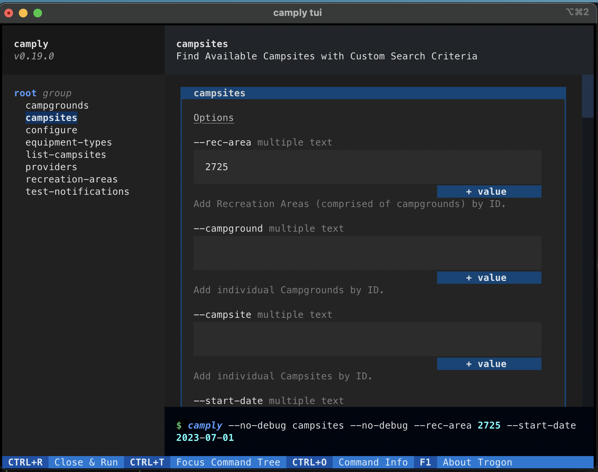

# Command Line Usage

When installed, `camply`'s command line utility can be invoked with the command, `camply`. The CLI
tool accepts one of six sub-arguments: `campsites`, `recreation-areas`, `campgrounds`, `providers`,
`equipment-types`, and `configure`.

!!! important

    The multi-line commands in this documentation correspond to running **`camply`** on a
    MacOS or Linux Shell. If you are a Windows user take note that multi-line commands
    on Windows Shells use the **`^`** character instead of **`\`** to escape new lines.

```console
❯ camply --help

 Usage: camply [OPTIONS] COMMAND [ARGS]...

 Welcome to camply, the campsite finder.
 Finding reservations at sold out campgrounds can be tough. That's where camply comes in. It searches the
 APIs of booking services like https://recreation.gov (which indexes thousands of campgrounds across the
 USA) to continuously check for cancellations and availabilities to pop up. Once a campsite becomes
 available, camply sends you a notification to book your spot!


 visit the camply documentation at https://juftin.com/camply

╭─ Options ──────────────────────────────────────────────────────────────────────────────────────────────╮
│                                                                                                        │
│  --debug/--no-debug             Enable extra debugging output                                          │
│  --provider              TEXT   Camping Search Provider. Defaults to 'RecreationDotGov'                │
│  --version                      Show the version and exit.                                             │
│  --help                         Show this message and exit.                                            │
│                                                                                                        │
╰────────────────────────────────────────────────────────────────────────────────────────────────────────╯
╭─ Commands ─────────────────────────────────────────────────────────────────────────────────────────────╮
│                                                                                                        │
│  campgrounds              Search for Campgrounds (inside of Recreation Areas) and list them            │
│  campsites                Find Available Campsites with Custom Search Criteria                         │
│  configure                Set up camply configuration file with an interactive console                 │
│  equipment-types          Get a list of supported equipment                                            │
│  list-campsites           List campsite IDs for a given campground or recreation area                  │
│  providers                List the different camply providers                                          │
│  recreation-areas         Search for Recreation Areas and list them                                    │
│  test-notifications       Test your notification provider setup                                        │
│  tui                      Open Textual TUI.                                                            │
│                                                                                                        │
╰────────────────────────────────────────────────────────────────────────────────────────────────────────╯
```

## Simple Examples

[Search for a specific recreation area](#search-for-recreation-areas-by-query-string) (recreation
areas contain campgrounds):

```commandline
camply recreation-areas --search "Glacier National Park"
```

[Search for campgrounds](#look-for-specific-campgrounds-by-query-string) (campgrounds
contain campsites):

```commandline
camply campgrounds --search "Fire Lookout Towers" --state CA
```

[Search for available campsites](#searching-for-a-campsite),
[get an notification whenever one becomes available](#send-a-push-notification), and
[continue searching after the first one is found](#continue-looking-after-the-first-match-is-found):

```commandline
camply campsites \
    --rec-area 2725 \
    --start-date 2023-07-10 \
    --end-date 2023-07-18 \
    --notifications email \
    --search-forever
```

## providers

List the various [providers](providers.md) that camply works with.

```commandline
camply providers
```

!!! note

    If no provider is specified, camply will use the default provider,
    **`RecreationDotGov`**, which searches for recreation areas,
    campgrounds, and campsites listed on https://recreation.gov

## campsites

Search for a campsite within camply. Campsites are returned based on the search criteria provided.
Campsites contain properties like booking date, site type (tent, RV, cabin, etc), capacity, price,
and a link to make the booking. Required parameters include `--start-date`, `--end-date`,
`--rec-area` / `--campground` / `--campsite`. Constant searching functionality can be enabled with
`--continuous` and notifications can be enabled using `--notifications` (see the
[Send a Push Notification](#send-a-push-notification) section for more information).

### Arguments

-   `--rec-area`: `RECREATION_AREA_ID`
    -   Add Recreation Areas (comprised of campgrounds) by ID.
        [\*\*_example_](#searching-for-a-campsite)
-   `--campground`: `CAMPGROUND_ID`
    -   Add individual Campgrounds by ID.
        [\*\*_example_](#searching-for-a-campsite-by-campground-id)
-   `--campsite`: `CAMPSITE_ID`
    -   Add individual Campsites by ID.
        [\*\*_example_](#searching-for-a-specific-campsite-by-id)
-   `--start-date`: `START_DATE`
    -   `YYYY-MM-DD`: Start of Search window. You will be arriving this day.
        [\*\*_example_](#searching-for-a-campsite)
-   `--end-date`: `END_DATE`
    -   `YYYY-MM-DD`: End of Search window. You will be checking out this day..
        [\*\*_example_](#searching-for-a-campsite)
-   `--day`
    -   Day(s) of the Week to search.
        [\*\*_example_](#searching-for-specific-weekdays)
-   `--weekends`
    -   Only search for weekend bookings (Fri/Sat nights).
        [\*\*_example_](#look-for-weekend-campsite-availabilities)
-   `--nights`
    -   Search for campsite stays with consecutive nights. Defaults to 1 which returns all campsites
        found.
        [\*\*_example_](#look-for-consecutive-nights-at-the-same-campsite)
-   `--provider`: `PROVIDER`
    -   Camping Search Provider. Defaults to 'RecreationDotGov', not case-sensitive. Options include:
        [RecreationDotGov](#searching-for-a-campsite), [Yellowstone](#look-for-a-campsite-inside-of-yellowstone),
        [GoingToCamp](#look-for-a-campsite-from-goingtocamp), [RecreationDotGovDailyTicket](#tickets-tours),
        [RecreationDotGovDailyTimedEntry](#timed-entry), [RecreationDotGovTicket](#tickets-tours),
        [RecreationDotGovTimedEntry](#timed-entry).
        [\*\*_example_](#look-for-a-campsite-inside-of-yellowstone)
-   `--continuous`
    -   Continuously check for a campsite to become available, and quit once at least one campsite is
        found.
        [\*\*_example_](#continuously-searching-for-a-campsite)
-   `--search-forever`
    -   Enables continuous searching. This method continues to search after the first availability
        has been found. The one caveat is that it will never notify about the same identical campsite
        for the same booking date.
        [\*\*_example_](#continue-looking-after-the-first-match-is-found)
-   `--notifications`: `NOTIFICATIONS`
    -   Enables continuous searching. Types of notifications to receive. Options available
        are `pushover`, `email`, `ntfy`, `apprise`, `pushbullet`, `slack`, `telegram`, `twilio`, `silent`.
        Defaults to `silent` - which just logs messages to console.
        [\*\*_example_](#send-a-push-notification)
-   `--equipment`
    -   Search for campsites compatible with your camping equipment. This argument accepts two
        options, the equipment name and its length If you don't want to filter based on length provide
        a length of 0. Accepted equipment names include `Tent`, `RV`. `Trailer`, `Vehicle` and are
        not case-sensitive.
        [\*\*_example_](#searching-for-a-campsite-that-fits-your-equipment)
-   `--equipment-id`
    -   Search for campsites campaitble with specific equipment categories. Going To Camp
        uses equipment category IDs for filtering campsites by equipment. Every recreation
        area has equipment categories unique to it.
        [\*\*_example_](#searching-goingtocamp-using-equipment)
-   `--notify-first-try`
    -   Enables continuous searching. Whether to send all non-silent notifications if more than 5
        matching campsites are found on the first try. Defaults to false which only sends the first5.
        [\*\*_example_](#continuously-searching-for-a-campsite)
-   `--polling-interval`: `POLLING_INTERVAL`
    -   Enables continuous searching. How often to wait in between checks (in minutes). Defaults to
        10, cannot be less than 5.
        [\*\*_example_](#look-for-weekend-campsite-availabilities)
-   `--yaml-config`
    -   Rather than provide arguments to the command line utility, instead pass a file path to a YAML
        configuration file. See the documentation for more information on how to structure your
        configuration file.
        [\*\*_example_](#using-a-yaml-configuration-file-to-search-for-campsites)
-   `--offline-search`
    -   When set to True, the campsite search will both save the results of the campsites it's
        found, but also load those campsites before beginning a search for other campsites.
        [\*\*_example_](#saving-the-results-of-a-search)
-   `--offline-search-path`
    -   Enables offline search. This is the name of the file to be saved/loaded. Campsites can be saved as
        a serialized pickle file or a JSON file, depending on the file extension. When not specified,
        the filename will default to `camply_campsites.json`.
        [\*\*_example_](#saving-the-results-of-a-search)
-   `--search-once`
    -   Enables continuous searching features - but doesn't actually search continuously. This option
        is only useful when you want to run camply periodically in a CRON job fashion but still
        receive notifications - it's strongly recommended you enable offline searching as
        well to save results between searches.
        [\*\*_example_](#run-camply-as-a-cron-job)

```commandline
camply campsites \
    --rec-area 2725 \
    --start-date 2023-07-10 \
    --end-date 2023-07-18
```

## recreation-areas

Search for Recreation Areas and their IDs. Recreation Areas are places like National Parks and
National Forests that can contain one or many campgrounds.

### Arguments

-   `--search` `SEARCH`
    -   Search for Campgrounds or Recreation Areas by search string.
-   `--state` `STATE`
    -   Filter by US state code.

```commandline
camply recreation-areas --search "Yosemite National Park"
```

\*\*_see the [examples](#search-for-recreation-areas-by-query-string) for more information_

## campgrounds

Search for Campgrounds and their IDs. Campgrounds are facilities inside of Recreation Areas that
contain campsites. Most 'campgrounds' are areas made up of multiple campsites, others are facilities
like fire towers or cabins that might only contain a single 'campsite' to book.

### Arguments

-   `--search` `SEARCH`
    -   Search for Campgrounds or Recreation Areas by search string.
-   `--state` `STATE`
    -   Filter by US state code.
-   `--rec-area`: `RECREATION_AREA_ID`
    -   Add Recreation Areas (comprised of campgrounds) by ID.
-   `--campground`: `CAMPGROUND_ID`
    -   Add individual Campgrounds by ID.

```commandline
camply campgrounds --search "Fire Tower Lookout" --state CA
```

\*\*_see the [examples](#look-for-specific-campgrounds-by-query-string) for more information_

## configure

Set up `camply` configuration file with an interactive console

In order to send notifications through `camply` you must set up some authorization values. Whether
you need to set up [Pushover notifications](https://pushover.net)
, [PushBullet](https://www.pushbullet.com/#settings/account), [Telegram](https://core.telegram.org/bots),
or Email messages, everything can be done through the `configure` command. The end result is a file called
[`.camply`](examples/example.camply) in your home folder. See
the [Running in Docker](how_to_run.md#running-in-docker) section to see how you can use environment variables
instead of a config file.

```commandline
camply configure
```

## test-notifications

Test your notification provider setup.

If you want to send yourself a test notification via camply, the `test-notifiactions`
command is for you. See the [Send a Push Notification](#send-a-push-notification)
section for more details on how to set up the notification provider of your choice.

```commandline
camply test-notifications --notifications email
```

## list-campsites

When [searching for a specific campsite by ID](#searching-for-a-specific-campsite-by-id), it can be useful
to list the campsites that were found. This command will list the campsites that were found given specific
camground / recreation area ID.

```commandline
camply list-campsites --campground 598 --provider ReserveCalifornia
```

That search above would tell you that `Premium Campsite #88` has ID #43473. Using that information you can then
search for that specific campsite by ID:

```commandline
camply campsites \
  --provider ReserveCalifornia \
  --campground 598 \
  --campsite 43473 \
  --start-date 2023-07-13 \
  --end-date 2023-07-14
```

!!! note

    Some providers require that you pass a campsite ID **and** and a campground ID, while
    others only require a campsite ID.

## tui

Camply has an optional TUI interface thanks to [textual](https://github.com/textualize/textual) and
[trogon](https://github.com/Textualize/trogon). A TUI is a text-based user interface that allows you to
interact with camply in a more visual way, it's a visual application that runs in your terminal.
The TUI config is a great way to set up your camp search with your mouse and keyboard, and then run
camply like you normally would.

!!! note

    Camply's TUI command requires that the **`tui`** extra is installed. To install camply with
    the TUI extra, run **`pipx install "camply[tui]"`**.

```commandline
camply tui
```



## Examples

Read through the examples below to get a better understanding of `camply`, its features, and the
functionality of the different arguments provided to the CLI.

### Searching for a Campsite

The below search looks for campsites inside of Recreation Area ID #2725 (Glacier National Park)
between 2023-07-10 and 2023-07-17. The search will be performed once and any results will be logged
to the console. camply searches for campsites inside of search windows in increments of one night.
`--start-date` and `--end-date` define the bounds of the search window, you will be leaving the day
after `--end-date`.

```commandline
camply campsites \
    --rec-area 2725 \
    --start-date 2023-07-10 \
    --end-date 2023-07-18
```

### Searching for a Campsite by Campground ID

The below search looks for across three campgrounds (all inside Glacier National Park)
between 2023-07-10 and 2023-07-17. Multiple Campgrounds (and Recreation Areas too) can be found by
supplying the arguments more than once.

```commandline
camply campsites \
    --campground 232493 \
    --campground 251869 \
    --campground 232492 \
    --start-date 2023-07-10 \
    --end-date 2023-07-18
```

### Searching for a Specific Campsite by ID

Sometimes you have a favorite campsite inside your favorite campground. To search for just a
specific campsite (and not just all campsites within a campground) you can give its ID to `camply`
with the `--campsite` argument. For example, site `R035` in Many Glacier Campground, MT is close to
a trailhead. Its URL
is [https://www.recreation.gov/camping/campsites/98363](https://www.recreation.gov/camping/campsites/98363)
, here we can see that it's ID is `98363`. You can search for one or many campsites by ID by
supplying the `--campsite` argument. You can provide the `--campsite` argument once or multiple
times to search for different campsites.

!!! note

    For **RecreationDotGov**, **`--campsite`** arguments override any **`--rec-area`** or **`--campground`** options
    provided. And **`--campground`** will override the **`--rec-area`** option.

    However other providers may need you to provide both a **`--campground`** and **`--campsite`** ID.
    See the [list-campsites](#list-campsites) example for more information.

```commandline
camply campsites \
    --campsite 98363 \
    --start-date 2023-07-10 \
    --end-date 2023-07-18
```

### Continuously Searching for A Campsite

Most of the time you want to look for campgrounds until an eventual match is found. The below snippet will
search for matching campsites until it finds a match. It also sends a notification via `pushover`
once matches are found. Alternate notification methods are listed in the
[Send a Push Notification](#send-a-push-notification) example.

!!! note

    The use of **`--continuous`** in the below example isn't actually necessary.
    Continuous searching is enabled when any of the following options are provided:
    **`--continuous`**, **`--notifications`**, **`--search-forever`**,
    **`--polling-interval`**, **`--notify-first-try`**.

```commandline
camply campsites \
    --rec-area 2725 \
    --start-date 2023-07-12 \
    --end-date 2023-07-13 \
    --continuous \
    --notifications pushover \
    --notify-first-try
```

!!! warning

    When `camply` is told to running continuously with non-silent notifications set up
    and it finds more than 5 matching campsites on the first try, it will only send notifications for
    the first 5 campsites. This is to prevent thousands of campsites flooding your notifications. It's
    always encouraged to perform an initial online search before setting up a `camply` search. To bypass
    this behavior and send all notifications, pass the `--notify-first-try` argument.

### Searching Across Multiple Time Windows

There might be an occasion where you're looking to search for a campsite across
multiple date ranges, i.e. any Monday in July. `camply` supports this quite nicely by
passing multiple `--start-date` and `--end-date` options.

!!! note

    The important rule about multiple **`--start-date`** and **`--end-date`** options
    is that ordering matters. If you provide multiple start dates and multiple end
    dates the first end date will correspond to the first start date, and so on
    and so forth.

```commandline
camply campsites \
    --rec-area 2725 \
    --start-date 2023-07-12 \
    --end-date 2023-07-13 \
    --start-date 2023-07-19 \
    --end-date 2023-07-20 \
    --start-date 2023-07-26 \
    --end-date 2023-07-27
```

### Continue Looking After The First Match Is Found

Sometimes you want to search for all possible matches up until your arrival date. No problem. Add
the `--search-forever` and `camply` won't stop sending notifications after the first match is found.

!!! note

    `camply` will save and store all previous notifications when
    **`--search-forever`** is enabled, so it won't notify you about the exact same
    campsite availability twice. This can be problematic when certain campsites become
    available more than once.

```commandline
camply campsites \
    --rec-area 2725 \
    --start-date 2023-07-01 \
    --end-date 2023-08-01 \
    --notifications pushover \
    --search-forever
```

### Send a Push Notification

camply supports notifications via a number of services:

-   [Pushover](https://pushover.net)
-   Email
-   [Ntfy](https://ntfy.sh)
-   [Apprise](https://github.com/caronc/apprise)
-   [Pushbullet](https://www.pushbullet.com/#settings/account)
-   [Slack](https://slack.com)
-   [Telegram](https://core.telegram.org/bots)
-   [Twilio (SMS)](https://www.twilio.com)
-   Silent

```commandline
camply campsites \
    --rec-area 2991 \
    --start-date 2023-09-10 \
    --end-date 2023-09-21 \
    --notifications pushover
```

Like all providers, `Pushover` requires that you share credentials/authentication - for `Pushover` this involves
sharing your "Pushover User Key" with camply through a [configuration file](examples/example.camply)
(via the **`camply configure`** command) or though environment variables (`PUSHOVER_PUSH_USER`). See the
[Environment Variables](how_to_run.md#environment-variables) section for a list of relevant environment variables
per notification provider.

!!! info

    When searching continuously `camply` uses the **`silent`** notification provider
    unless you expictly specify another notification provider to use. The **`silent`** notification
    provider simply prints logs to your console when matching campsites are found.

!!! note

    I personally use [Pushover](https://pushover.net) notifications - it's built for push notifications, easy to set up,
    and includes a 30-day trial and a one-time fee of $5 after that to unlock lifetime programmatic push notifications.
    There are other notification providers like `Ntfy`, `Slack` and `Email` that are free to use if that's more your style.

### Send a Text Message

If you want to sign up for a [Twilio](https://www.twilio.com/try-twilio) account, camply also supports
sending text messages via SMS. You can set up your Twilio configuration via `camply configure`. You will need
to set the following config values for Twilio: `TWILIO_ACCOUNT_SID`, `TWILIO_AUTH_TOKEN`,
`TWILIO_SOURCE_NUMBER`, `TWILIO_DEST_NUMBERS`.

Sending text messages via Twilio also requires the `twilio` extras:

```
pip install camply[twilio]
```

```commandline
camply campsites \
    --rec-area 2991 \
    --start-date 2023-09-10 \
    --end-date 2023-09-21 \
    --notifications twilio
```

### Send a Notification to Different Services

camply supports notifications from different providers. To send notifications to multiple providers
you can pass the --notifications parameter multiple times. YAML config entries also
accept an array as well.

```commandline
camply campsites \
    --rec-area 2991 \
    --start-date 2023-09-10 \
    --end-date 2023-09-21 \
    --notifications email \
    --notifications pushover
```

### Send a Notification Using Apprise-Compatible Services

In addition to the built-in notification providers, you can also send notifications using one of the
many popular services supported by [Apprise](https://github.com/caronc/apprise). You'll need
to set up a supported notification URL using the `APPRISE_URL` config value; Refer to the Apprise
documentation to learn how to format a URL to fit your needs.

Using Apprise notifications requires the `apprise` extras:

```
pip install camply[apprise]
```

### Searching for Specific Weekdays

The below search spans across a three-month time window, but it only looks for campsites that
are available on a Tuesday or Wednesday night.

!!! note

    You can use the day's full spelling or an abbreviation - and neither is case sensitive.

```commandline
camply campsites \
    --campground 232446 \
    --start-date 2023-05-01 \
    --end-date 2023-08-01 \
    --day Tuesday \
    --day Wednesday
```

### Look for Weekend Campsite Availabilities

This below search looks across larger periods of time, but only if a campground is available to book
on a Friday or Saturday night (`--weekends`). It also uses the `--polling-interval` argument which
checks every 5 minutes instead of the default 10 minutes.

```commandline
camply campsites \
    --rec-area 2991 \
    --start-date 2023-05-01 \
    --end-date 2023-08-01 \
    --weekends \
    --notifications email \
    --polling-interval 5
```

!!! note

    Using the **`--weekends`** option is the same as specifying
    **`--day Friday`** + **`--day Saturday`**.

### Look for Consecutive Nights at the Same Campsite

A lot of times you need to search for consecutive nights at the same campsite. By default, any and
all campsites with a single nights booking are returned by camply. To search for campsites with
consecutive night stays, pass the `--nights` argument.

!!! note

    The **`--nights`** argument handles issues with improper search parameters. For example, if you
    set the **`--weekends`** parameter the maximum number of consecutive nights possible is 2. If you supply
    more than this your **`--nights`** parameter will be overwritten to 2.

```commandline
camply campsites \
    --rec-area 2991 \
    --start-date 2023-05-01 \
    --end-date 2023-08-01 \
    --nights 4
```

### Look for a Campsite Inside of Yellowstone

Yellowstone doesn't use https://recreation.gov to manage its campgrounds, instead it uses its own
proprietary system. In order to search the Yellowstone API for campsites, make sure to pass
the `--provider "yellowstone"` argument. This flag disables `--rec-area` argument.

To learn more about using `camply` to find campsites at Yellowstone, check out
this [discussion](https://github.com/juftin/camply/discussions/15#discussioncomment-783657).

```commandline
camply campsites \
    --provider yellowstone \
    --start-date 2023-07-09 \
    --end-date 2023-07-17 \
    --continuous
```

### Look for a Campsite from GoingToCamp

!!! note

    The GoingToCamp provider supports lots of different park systems, including
    Washington State Parks, Canada National Parks, and more. See the
    [GoingToCamp](providers.md#goingtocamp) provider documentation for more information.

The `GoingToCamp` provider requires that you specify both a Recreation Area and a
Campground in your search. First you'll need to find your Recreation Area ID:

```commandline
camply recreation-areas --provider goingtocamp
```

For this example we'll search Washington State Parks which corresponds to Recreation Area ID #4.
Next we'll list the Campgrounds within the Recreation Area:

```commandline
camply campgrounds --provider goingtocamp --rec-area 4
```

The above command will list all of the campgrounds within our Recreation Area.
For the next example we'll search for an availability at Bay Bridge State Park,
which is in our Recreation Area and corresponds to Campground ID #-2147483645
(GoingToCamp regularly uses negative ID numbers).

```commandline
camply campsites \
  --provider goingtocamp \
  --rec-area 4 \
  --campground -2147483645 \
  --start-date 2023-09-01 \
  --end-date 2023-09-02
```

### Searching GoingToCamp Using Equipment

In the [previous GoingToCamp example](#look-for-a-campsite-from-goingtocamp) we were searching
Recreation Area ID #4 and Campground ID #-2147483645. GoingToCamp also allows
us to search for campsites using equipment filters. In order to find the corresponding equipment
IDs, you'll use the `equipment-types` command and pass in the Recreation Area ID:

```commandline
camply equipment-types --provider goingtocamp --rec-area 4
```

The previous command will list all of the Equipment IDs for your Recreation Area.
For our example we will use Equipment ID #-32763 which corresponds to an `RV/Trailer up to 25'`.
Next we can use that Equipment ID in our search:

```commandline
camply campsites \
  --provider goingtocamp \
  --rec-area 4 \
  --campground -2147483645 \
  --start-date 2023-09-01 \
  --end-date 2023-09-02 \
  --equipment-id -32763
```

### Look for a Campsite Across Multiple Recreation areas

You don't have to confine your search to a single Recreation or Campground ID. Adding multiple
arguments to the command line will search across multiple IDs. Keep in mind that any `--campground`
arguments will overwrite all `--rec-area` arguments.

```commandline
camply campsites \
    --rec-area 2991 \
    --rec-area 1074 \
    --start-date 2023-07-09 \
    --end-date 2023-07-17 \
    --nights 5
```

### Using a YAML Configuration file to search for campsites

Sometimes, using a YAML configuration file is easier to manage all of your search options. See the
below [YAML example file](examples/example_search.yaml) and corresponding camply command:

```yaml
--8<-- "docs/examples/example_search.yaml"
```

```commandline
camply campsites --yaml-config example_search.yaml
```

!!! note

    A JSON Schema for the YAML configuration file can be found at
    [docs/yaml_search.json](yaml_search.json)

### Searching for a Campsite That Fits Your Equipment

Camply can help you filter campsites to fit your specific equipment, like a Trailer or an RV.
Most likely, you care that the campsite fits the length of your RV so you can specify that as well.
To search for specific equipment and its length provide the `--equipment` option with two arguments,
the equipment name and the equipment length. If you don't want to filter based on length provide a
length of zero. If you provide multiple `--equipment` options, sites matching any of your search
equipment will be returned.

Current supported equipment names are `Vehicle`, `Tent`, `RV`, and `Trailer`. Be careful when
filtering on `Tents` and `Vehicle` length, sometimes Recreation.gov doesn't provide that information,
it is safer to set length to 0.

```commandline
camply campsites \
    --rec-area 2991 \
    --start-date 2023-07-09 \
    --end-date 2023-07-17 \
    --nights 5 \
    --equipment RV 25
```

Here's what the above search would look like on a YAML Config:

```yaml
recreation_area:
    - 2991
start_date: 2023-07-09
end_date: 2023-07-17
nights: 5
equipment:
    - [RV, 25]
```

Finally, here's a search that accommodates trailers of all lengths:

```commandline
camply campsites \
    --rec-area 2991 \
    --start-date 2023-07-09 \
    --end-date 2023-07-17 \
    --nights 5 \
    --equipment Trailer 0
```

### Saving the Results of a Search

In some cases, you might want to save all the campsites found during one
search and load them into a new search, so you don't receive duplicate notifications.
This can be achieved by passing the `--offline-search` flag. By default, camply will save
the results in a file called `camply_campsites.json`.

Alternatively, you can also path the `--offline-search-path` flag to specify a certain file
path to save the results as. When a file path with a `.json` extension is passed
camply will export the results as a JSON file. When the `.pkl` or `.pickle` extension is
used, camply will use a serialized Pickle file.

```commandline
camply \
  campsites \
  --campground 232064 \
  --start-date 2023-09-01 \
  --end-date 2023-10-01 \
  --continuous \
  --offline-search
```

```commandline
camply \
  campsites \
  --campground 232064 \
  --start-date 2023-09-01 \
  --end-date 2023-10-01 \
  --continuous \
  --offline-search-path campsites.pkl
```

### Search for Recreation Areas by Query String

Just need to find what your local Recreation Area ID number is? This simple command allows you to
search and list recreation areas. It accepts `--search` and `--state` arguments.

```commandline
camply recreation-areas --search "Yosemite National Park"
```

### Look for Specific Campgrounds Within a Recreation Area

Need to get even more specific and search for a particular campground? This search lists campgrounds
attached to a recreation area id `--rec-area`. It also accepts `--search` and `--state`
arguments.

```commandline
camply campgrounds --rec-area 2991
```

### Look for Specific Campgrounds by Query String

The below search looks for Fire Lookout Towers to stay in inside of California.

```commandline
camply campgrounds --search "Fire Tower Lookout" --state CA
```

### Searching for Tickets and Timed Entries

The [Recreation.gov Tickets, Tours, & Timed-Entry Providers](providers.md#recreationgov-tickets-tours--timed-entry)
support "campgrounds" that are actually resources like timed entry appointments and tickets
to recreation activities.

#### Tickets + Tours

Let's say you're going on vacation in Hawaii and you're interested in what hiking tickets are available:

```commandline
camply campgrounds \
    --provider RecreationDotGovTicket \
    --state HI
```

Nice, there are some great options there. Let's say we've decided on
the [Haleakala National Park Summit Sunrise Reservations](https://www.recreation.gov/ticket/facility/253731).
This "campground" has ID #253731. These reservations are hard to snag but they do pop up!

```commandline
camply campsites \
  --provider RecreationDotGovTicket \
  --start-date 2023-06-09 \
  --end-date 2023-06-10 \
  --campground 253731 \
  --search-forever \
  --notifications email
```

#### Timed Entry

Let's say you're visiting Oregon and wanting to visit
the [Lava River Cave](https://www.recreation.gov/timed-entry/10089508). They've recently implemented a Timed Reservation
System - so we'd use the `RecreationDotGovTimedEntry` provider:

```commandline
camply campgrounds \
    --provider RecreationDotGovTimedEntry \
    --state OR
```

Using the above command we can see that the campground ID we want is #10089508:

```commandline
camply campsites \
  --provider RecreationDotGovTimedEntry \
  --start-date 2023-06-09 \
  --end-date 2023-06-10 \
  --campground 10089508 \
  --search-forever \
  --notifications email
```

#### Using the Daily Providers

You'll also notice that there are alternative daily providers for our tours
and timed entry providers: `RecreationDotGovTicket` -> `RecreationDotGovDailyTicket` and
`RecreationDotGovTimedEntry` -> `RecreationDotGovDailyTimedEntry`. These providers search the
same recreation activities as their non-daily counterparts but there are scenarios where you
might want to use the daily provider.

When you use the daily provider it issues an API request for each day in your search
range, instead of once per month with the non-daily providers. This means that you can
make as many as 31x more API requests compared to the non-daily counterpart. `camply` needs
to be respectful of recreation.gov so always use the non-daily version when you have a large
search window.

It's suspected that the non-daily providers return "cached" results and can take longer to reflect
actual inventory. When you have a small search window, or if you need to use the `--equipment` filtering
functionality, then you should use the daily provider.

In the following scenario we'll search for tickets to a great attraction,
the [Keys Ranch Tour](https://www.recreation.gov/ticket/300004/ticket/1040), in Joshua Tree National Park.

Here's how you could search for that and retrieve its campground ID, #300004:

```commandline
camply campgrounds \
    --provider RecreationDotGovDailyTicket \
    --search "Keys Ranch Tour"
```

Great, now let's search:

```commandline
camply campsites \
  --provider RecreationDotGovDailyTicket \
  --start-date 2023-07-06 \
  --end-date 2023-07-07 \
  --campground 300004
```

Let's take it even a step further, let's say you need 4 spots in their 1:00PM time slot. In this case we can search
for that timeslot using the `--equipment` option and providing the time and minimum spots needed (`1300` and `4`):

```commandline
camply campsites \
  --provider RecreationDotGovDailyTicket \
  --start-date 2023-07-06 \
  --end-date 2023-07-07 \
  --campground 300004 \
  --equipment 1300 4
```

Here's another example of searching for a specific time, this time for the timed-entry
[Tuweep Area Day Use Passes](https://www.recreation.gov/timed-entry/10089462) in Grand Canyon
National Park (ID #10089462). In this example we're looking for any number of spots in
their 8:00AM-5:00PM time slot:

```commandline
camply campsites \
  --provider RecreationDotGovDailyTimedEntry \
  --start-date 2023-07-06 \
  --end-date 2023-07-07 \
  --campground 10089462 \
  --equipment 0800 0
```

### Search ReserveCalifornia

[ReserveCalifornia](providers.md#reservecalifornia) is the online booking provider for California State Parks
and it works a lot like `RecreationDotGov`.

!!! note

    ReserveCalifornia is one of many providers that use the UseDirect API. The following providers are also supported:

    -   **`AlabamaStateParks`**: Searches on [ReserveAlaPark.com](https://reservealapark.com) for Campsites
    -   **`ArizonaStateParks`**: Searches on [AZStateParks.com](https://azstateparks.com) for Campsites
    -   **`FloridaStateParks`**: Searches on [FloridaStateParks.org](https://www.reserve.floridastateparks.org) for Campsites
    -   **`MinnesotaStateParks`**: Searches on [ReserveMN.usedirect.com](https://reservemn.usedirect.com) for Campsites
    -   **`MissouriStateParks`**: Searches on [icampmo1.usedirect.com](https://icampmo1.usedirect.com) for Campsites
    -   **`OhioStateParks`**: Searches on [ReserveOhio.com](https://reserveohio.com) for Campsites
    -   **`VirginiaStateParks`**: Searches on [ReserveVAParks.com](https://reservevaparks.com) for Campsites
    -   **`NorthernTerritory`**: Searches the [Australian Northern Territory](https://parkbookings.nt.gov.au) for Campsites
    -   **`FairfaxCountyParks`**: Searches on [fairfax.usedirect.com](https://fairfax.usedirect.com) for Campsites (Virginia)
    -   **`MaricopaCountyParks`**: Searches on [MaricopaCountyParks.org](https://maricopacountyparks.org) for Campsites (Arizona)
    -   **`OregonMetro`**: Searches on [OregonMetro.gov](https://oregonmetro.gov) for Campsites (Portland Metro)

If you wanted to look for recreation areas (groupings of campgrounds):

```commandline
camply recreation-areas --provider ReserveCalifornia --search "Los Angeles"
```

If you want to look for more specific campgrounds to search:

```commandline
camply campgrounds --provider ReserveCalifornia --search "Sonoma Coast"
```

And finally, searching for a campsite is very similar to [RecreationDotGov](#searching-for-a-campsite):

```commandline
camply campsites \
    --provider ReserveCalifornia \
    --start-date 2023-07-01 \
    --end-date 2023-08-01 \
    --rec-area 718 \
    --weekends
```

!!! note

    **`ReserveCalifornia`** doesn't yet support searching / filtering by *equipment*.

### Run camply as a CRON Job

In some instances you don't want to run camply as a continuous, blocking Python
process. Instead you might want to run camply as a CRON job that checks for a campsite
every 30 minutes (**`*/30 * * * *`**). In this case you would use the `--search-once` option
which enables continuous searching functionality (like sending notifications) without
actually searching continuously.

Make sure to save your search results offline if running camply as a CRON job, this allows
camply to save any campsites it finds between searches so that it only sends you a notification once:

```commandline
camply campsites \
    --rec-area 2725 \
    --start-date 2023-07-10 \
    --end-date 2023-07-18 \
    --notifications email \
    --search-once \
    --offline-search
```
