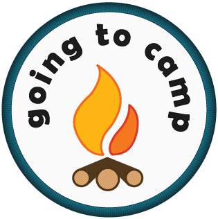
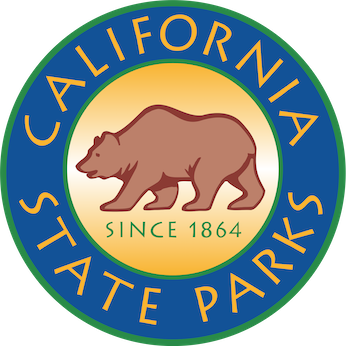

# Providers

camply works with a number of providers. A "provider" is an Online Booking
Service that lists camping and recreation inventory.

!!! info

    Rather than specifiying provider with the **`--provider`** option on the
    command line you can also set the **`CAMPLY_PROVIDER`** environnment
    variable.

## Recreation.gov

{: .center}

[Recreation.gov](https://recreation.gov) is (so far) the largest and most widely supported
provider. This provider spans over thousands of campgrounds across the USA including most of our National
parks.

You can find the best documentation for searching for campsites over at the main documentation
page: [Command Line Usage](command_line_usage.md#Command-Line-Usage)

```commandline
camply campgrounds --provider RecreationDotGov --state CA --search "Fire Towers"
```

## Yellowstone

{: .center}

Yellowstone is one of the few National Parks that uses a Campsite Booking provider other
than [Recreation.gov](#recreationgov). A number of the campgrounds in Yellowstone can be
booked through [YellowstoneNationalParkLodges.com](https://www.yellowstonenationalparklodges.com/stay/camping/).
Read more about using camply to search this provider on
the [documentation](command_line_usage.md#look-for-a-campsite-inside-of-yellowstone).

```commandline
camply --provider Yellowstone campgrounds
```

The Yellowstone Provider currently supports the following Campgrounds:

-   Bridge Bay Campground (YLYB:RV)
-   Canyon Campground (YLYC:RV)
-   Fishing Bridge RV Park (YLYF:RV)
-   Grant Campground (YLYG:RV)
-   Madison Campground (YLYM:RV)

## GoingToCamp

{: .center}

[GoingToCamp](https://goingtocamp.com/) provides campground listing and booking services for several US state and
Canadian provincial parks.

To get a listing of GoingToCamp recreation areas

```
camply --provider goingtocamp recreation-areas
```

Unlike other camply providers, when using GoingToCamp you must restrict campground and campsites searches to a single
recreation area. Since recreation areas may list every campground in a state or provincial park system, it feels natural
to filter searches by recreation area when using GoingToCamp.

The GoingToCamp Provider currently contains the following Recreation Areas:

-   Algonquin Highlands, Ontario, CA (#8)
-   BC Parks, British Columbia, CA (#12)
-   Gatineau Park, Ottawa-Gatineau, Ontario-Quebec, CA (#10)
-   Long Point Region, Ontario, CA (#1)
-   Maitland Valley, Ontario, CA (#4)
-   Maryland State Parks, Maryland, USA (#9)
-   Newfoundland & Labrador Provincial Parks, Newfoundland and Labrador, CA (#11)
-   Saugeen Valley, Ontario, CA (#5)
-   St. Clair Region, Ontario, CA (#2)
-   Tacoma Power Parks, Washington, USA (#6)
-   Washington State Parks, Washington, USA (#3)
-   Wisconsin State Parks, Wisconsin, USA (#7)

Check out the following documentation examples for more details on searching GoingToCamp recreation areas:

-   [Look for a Campsite from GoingToCamp](command_line_usage.md#look-for-a-campsite-from-goingtocamp)
-   [Searching GoingToCamp Using Equipment](command_line_usage.md#searching-goingtocamp-using-equipment)

## Recreation.gov Tickets, Tours, & Timed-Entry

{: .center}

Apart from reservations for campsites, Recreation.gov also supports reserving tickets & tours there are thousands of
tickets and tours options available around the USA.

[Search for Tickets, Tours, & Timed-Entry Online](https://www.recreation.gov/search?inventory_type=tours)

### Tours & Tickets

```commandline
camply campgrounds --provider RecreationDotGovTicket --state HI
```

### Timed Entry

```commandline
camply campgrounds --provider RecreationDotGovTimedEntry --state OR
```

-   [Searching for Tickets and Timed Entries](command_line_usage.md#searching-for-tickets-and-timed-entries)
    -   [Tickets + Tours](command_line_usage.md#tickets-tours)
    -   [Timed Entry](command_line_usage.md#timed-entry)
    -   [Using the Daily Providers](command_line_usage.md#using-the-daily-providers)

## ReserveCalifornia

{: .center}

[ReserveCalifornia](https://reservecalifornia.com/) is the Online Booking provider for California State Parks.
With 279 park units, over 340 miles of coastline, 970 miles of lake and river frontage, 15,000 campsites,
5,200 miles of trails, the California Department of Parks and Recreation (State Parks) contains the largest and
most diverse recreational holdings of any state agency in the nation.

```commandline
camply recreation-areas --provider ReserveCalifornia --search "Los Angeles"
```

```commandline
camply campgrounds --provider ReserveCalifornia --search "Sonoma Coast"
```

```commandline
camply campsites \
    --provider ReserveCalifornia \
    --start-date 2023-07-01 \
    --end-date 2023-08-01 \
    --rec-area 718 \
    --weekends
```

-   [Search ReserveCalifornia](command_line_usage.md#search-reservecalifornia)
